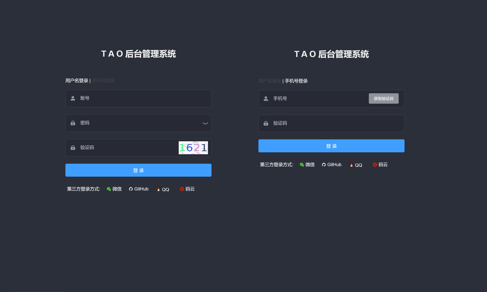

# tao

基于 Spring Boot 的 RBAC 权限管理系统项目 

[预览地址](https://tao.flizi.cn) [文档说明](https://doc-tao.flizi.cn)

# 前后端分离

前端技术:

- [vue.js](https://github.com/vuejs/vue)
- [vue-element-admin](https://github.com/PanJiaChen/vue-element-admin)

后端技术:

- [Spring Boot 2.3.x](https://github.com/spring-projects/spring-boot)
- [Spring Security 5.x](https://github.com/spring-projects/spring-security) 

> spring-social, security-oauth 不再更新, 这里将不引入相关包

# 个人公众号

