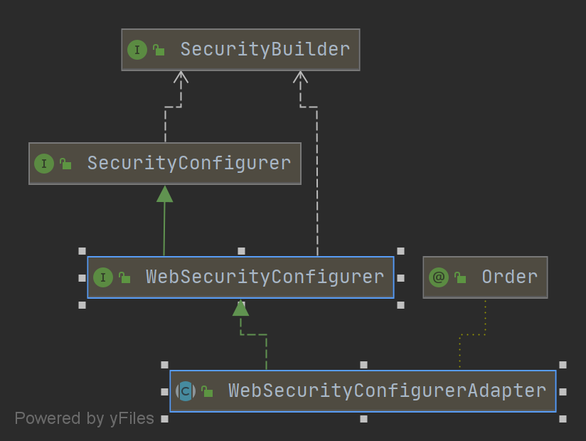

# SecurityAutoConfiguration

```java
@Configuration(proxyBeanMethods = false)
@ConditionalOnClass(DefaultAuthenticationEventPublisher.class)
@EnableConfigurationProperties(SecurityProperties.class)
@Import({ SpringBootWebSecurityConfiguration.class, // 提供默认WebSecurityConfigurerAdapter
	WebSecurityEnablerConfiguration.class, // 核心配置
	SecurityDataConfiguration.class }) // 提供Spring Data 支持
public class SecurityAutoConfiguration {

	// 定义了一个事件发布器
	@Bean
	@ConditionalOnMissingBean(AuthenticationEventPublisher.class)
	public DefaultAuthenticationEventPublisher authenticationEventPublisher(ApplicationEventPublisher publisher) {
		return new DefaultAuthenticationEventPublisher(publisher);
	}

}
```
# SpringBootWebSecurityConfiguration

当用户没有自定义情况下,提供一个默认的WebSecurityConfigurerAdapter

```java
@Configuration(proxyBeanMethods = false)
@ConditionalOnClass(WebSecurityConfigurerAdapter.class)
@ConditionalOnMissingBean(WebSecurityConfigurerAdapter.class)
@ConditionalOnWebApplication(type = Type.SERVLET)
public class SpringBootWebSecurityConfiguration {

	@Configuration(proxyBeanMethods = false)
	@Order(SecurityProperties.BASIC_AUTH_ORDER)
	static class DefaultConfigurerAdapter extends WebSecurityConfigurerAdapter {

	}

}
```


# WebSecurityEnablerConfiguration

引入核心注解 @EnableWebSecurity

```java
@Configuration(proxyBeanMethods = false)
@ConditionalOnBean(WebSecurityConfigurerAdapter.class)
@ConditionalOnMissingBean(name = BeanIds.SPRING_SECURITY_FILTER_CHAIN)
@ConditionalOnWebApplication(type = ConditionalOnWebApplication.Type.SERVLET)
@EnableWebSecurity // 核心注解
public class WebSecurityEnablerConfiguration {

}
```

# @EnableWebSecurity
```java
@Retention(value = java.lang.annotation.RetentionPolicy.RUNTIME)
@Target(value = { java.lang.annotation.ElementType.TYPE })
@Documented
@Import({ WebSecurityConfiguration.class, // [重点]
	SpringWebMvcImportSelector.class,
	OAuth2ImportSelector.class })
@EnableGlobalAuthentication // 引入全局配置[重点]
@Configuration
public @interface EnableWebSecurity {

	/**
	 * Controls debugging support for Spring Security. Default is false.
	 * @return if true, enables debug support with Spring Security
	 */
	boolean debug() default false;
}
```

# WebSecurityConfiguration

1. 先调用 setFilterChainProxySecurityConfigurer(),构建 WebSecurity,并托管给 Spring 
2. 在调用 springSecurityFilterChain() 构建  springSecurityFilterChain 过滤器链 
	主要是调用 上一步的创建的 WebSecurity 对象父类AbstractConfiguredSecurityBuilder的 build() 方法
```java
@Configuration(proxyBeanMethods = false)
public class WebSecurityConfiguration implements ImportAware, BeanClassLoaderAware {
	private WebSecurity webSecurity;

	private Boolean debugEnabled;

	private List<SecurityConfigurer<Filter, WebSecurity>> webSecurityConfigurers;

	private ClassLoader beanClassLoader;

	@Autowired(required = false)
	private ObjectPostProcessor<Object> objectObjectPostProcessor;

	@Bean
	public static DelegatingApplicationListener delegatingApplicationListener() {
		return new DelegatingApplicationListener();
	}

	@Bean
	@DependsOn(AbstractSecurityWebApplicationInitializer.DEFAULT_FILTER_NAME)
	public SecurityExpressionHandler<FilterInvocation> webSecurityExpressionHandler() {
		return webSecurity.getExpressionHandler();
	}

	// [2] 创建Spring Security的过滤器链
	@Bean(name = AbstractSecurityWebApplicationInitializer.DEFAULT_FILTER_NAME)
	public Filter springSecurityFilterChain() throws Exception {
		// 默认至少有一个setFilterChainProxySecurityConfigurer()中有分析
		boolean hasConfigurers = webSecurityConfigurers != null && !webSecurityConfigurers.isEmpty();
		if (!hasConfigurers) {
			WebSecurityConfigurerAdapter adapter = objectObjectPostProcessor.postProcess(new WebSecurityConfigurerAdapter() {});
			webSecurity.apply(adapter);
		}
		return webSecurity.build(); // 核心步骤
	}

	@Bean
	@DependsOn(AbstractSecurityWebApplicationInitializer.DEFAULT_FILTER_NAME)
	public WebInvocationPrivilegeEvaluator privilegeEvaluator() {
		return webSecurity.getPrivilegeEvaluator();
	}

	/**
	 * [1]
	 * 收集 <SecurityConfigurer<FilterChainProxy, WebSecurityBuilder> 实例,并进行排序后, 用以创建并初始化 WebSecurity 
	 * @param objectPostProcessor  自动装配处理器 AutowireBeanFactoryObjectPostProcessor
	 * @param webSecurityConfigurers 通过本类定义的 AutowiredWebSecurityConfigurersIgnoreParents Bean 的 getWebSecurityConfigurers() 返回值作为参数
	 * 实际代码
	 *	List<SecurityConfigurer<Filter, WebSecurity>> webSecurityConfigurers = new ArrayList<>();
	 *	Map<String, WebSecurityConfigurer> beansOfType = beanFactory.getBeansOfType(WebSecurityConfigurer.class);
	 *	for (Entry<String, WebSecurityConfigurer> entry : beansOfType.entrySet()) {
	 *		webSecurityConfigurers.add(entry.getValue());
	 *	}
	 *	return webSecurityConfigurers;
	 * 也就是说,如果我们没有自定义webSecurityConfigurer,那么就会导入上文 SpringBootWebSecurityConfiguration 中的DefaultConfigurerAdapter,因为DefaultConfigurerAdapter也是一个
	 * WebSecurityConfigurer
	 */
	@Autowired(required = false)
	public void setFilterChainProxySecurityConfigurer(
			ObjectPostProcessor<Object> objectPostProcessor, 
			@Value("#{@autowiredWebSecurityConfigurersIgnoreParents.getWebSecurityConfigurers()}") List<SecurityConfigurer<Filter, WebSecurity>> webSecurityConfigurers) 
			throws Exception {
			
		webSecurity = objectPostProcessor.postProcess(new WebSecurity(objectPostProcessor)); // 创建 WebSecurity, 并手动托管给Spring

		webSecurityConfigurers.sort(AnnotationAwareOrderComparator.INSTANCE); // 对配置排序

		Integer previousOrder = null;
		Object previousConfig = null;
		
		// 优先级不能相同
		for (SecurityConfigurer<Filter, WebSecurity> config : webSecurityConfigurers) {
			Integer order = AnnotationAwareOrderComparator.lookupOrder(config);
			if (previousOrder != null && previousOrder.equals(order)) {
				throw new IllegalStateException(
						"@Order on WebSecurityConfigurers must be unique. Order of "
								+ order + " was already used on " + previousConfig + ", so it cannot be used on "
								+ config + " too.");
			}
			previousOrder = order;
			previousConfig = config;
		}
		 // 保存 SecurityConfigurer 到 WebSecurity 父类的 AbstractConfiguredSecurityBuilder 中 configurers Map中
		for (SecurityConfigurer<Filter, WebSecurity> webSecurityConfigurer : webSecurityConfigurers) {
			webSecurity.apply(webSecurityConfigurer);
		}
		// 保存 webSecurityConfigurers 在当前类
		this.webSecurityConfigurers = webSecurityConfigurers;
	}

	@Bean
	public static BeanFactoryPostProcessor conversionServicePostProcessor() {
		return new RsaKeyConversionServicePostProcessor();
	}

	@Bean
	public static AutowiredWebSecurityConfigurersIgnoreParents autowiredWebSecurityConfigurersIgnoreParents(
			ConfigurableListableBeanFactory beanFactory) {
		return new AutowiredWebSecurityConfigurersIgnoreParents(beanFactory);
	}
	
	// Spring ImportAware 接口提供, 可以检查到使用Import注入当前类的属性信息,这里使用@EnableWebSecurity提供导入的
	// 所以这里能看到EnableWebSecurity的相关信息,主要是是否开启debug模式
	public void setImportMetadata(AnnotationMetadata importMetadata) {
		Map<String, Object> enableWebSecurityAttrMap = importMetadata
				.getAnnotationAttributes(EnableWebSecurity.class.getName());
		AnnotationAttributes enableWebSecurityAttrs = AnnotationAttributes
				.fromMap(enableWebSecurityAttrMap);
		debugEnabled = enableWebSecurityAttrs.getBoolean("debug");
		if (webSecurity != null) {
			webSecurity.debug(debugEnabled);
		}
	}
	
	// Spring BeanClassLoaderAware 接口提供的功能, 获取ClassLoader
	public void setBeanClassLoader(ClassLoader classLoader) {
		this.beanClassLoader = classLoader;
	}
}
```


# AbstractConfiguredSecurityBuilder#build()

主要就是执行了收集到的SecurityConfigurer实例的方法

```java
class AbstractConfiguredSecurityBuilder {
    public final O build() {
        if (this.building.compareAndSet(false, true)) {
            this.object = doBuild();
            return this.object;
        }
        throw new AlreadyBuiltException("This object has already been built");
    }
    protected final O doBuild()  {
        synchronized (configurers) {
            buildState = BuildState.INITIALIZING;
    
            beforeInit(); 
            init(); // 执行所有SecurityConfigurer的中的init() 方法
    
            buildState = BuildState.CONFIGURING;
    
            beforeConfigure();
            configure();  // 执行所有SecurityConfigurer的中的 configure() 方法,默认空实现
    
            buildState = BuildState.BUILDING;
    
            O result = performBuild();
    
            buildState = BuildState.BUILT;
    
            return result;
        }
    }
}
```

# WebSecurityConfigurerAdapter

- init() 



```java
class WebSecurityConfigurerAdapter {
    public void init(final WebSecurity web) throws Exception {
        final HttpSecurity http = getHttp();
        web.addSecurityFilterChainBuilder(http).postBuildAction(() -> {
            FilterSecurityInterceptor securityInterceptor = http.getSharedObject(FilterSecurityInterceptor.class);
            web.securityInterceptor(securityInterceptor);
        });
    }
    
    protected final HttpSecurity getHttp() {
        if (http != null) {
            return http;
        }
    
        AuthenticationEventPublisher eventPublisher = getAuthenticationEventPublisher();
        localConfigureAuthenticationBldr.authenticationEventPublisher(eventPublisher);
    
        AuthenticationManager authenticationManager = authenticationManager();
        authenticationBuilder.parentAuthenticationManager(authenticationManager);
        Map<Class<?>, Object> sharedObjects = createSharedObjects();
    
        http = new HttpSecurity(objectPostProcessor, authenticationBuilder,
                sharedObjects);
        if (!disableDefaults) {
            // @formatter:off
            http
                .csrf().and()
                .addFilter(new WebAsyncManagerIntegrationFilter())
                .exceptionHandling().and()
                .headers().and()
                .sessionManagement().and()
                .securityContext().and()
                .requestCache().and()
                .anonymous().and()
                .servletApi().and()
                .apply(new DefaultLoginPageConfigurer<>()).and()
                .logout();
            // @formatter:on
            ClassLoader classLoader = this.context.getClassLoader();
            List<AbstractHttpConfigurer> defaultHttpConfigurers =
                    SpringFactoriesLoader.loadFactories(AbstractHttpConfigurer.class, classLoader);
    
            for (AbstractHttpConfigurer configurer : defaultHttpConfigurers) {
                http.apply(configurer);
            }
        }
        configure(http);
        return http;
    }
}
```

